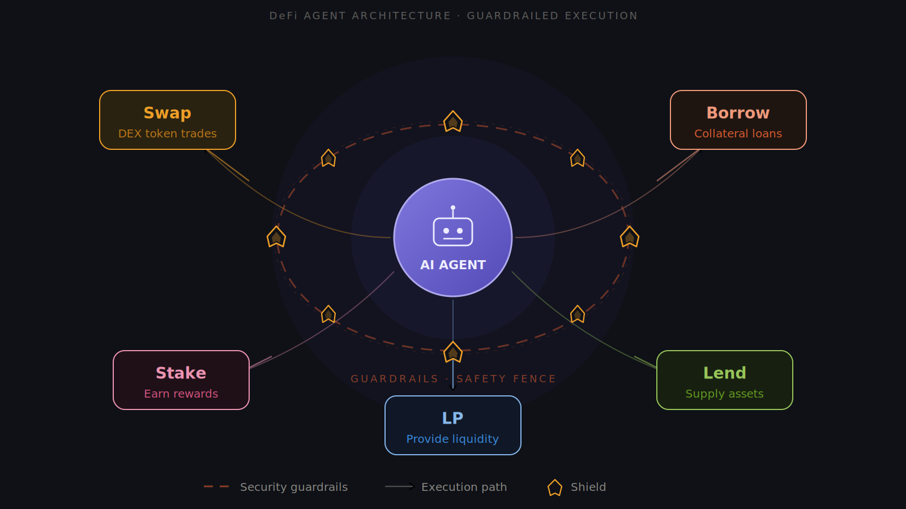
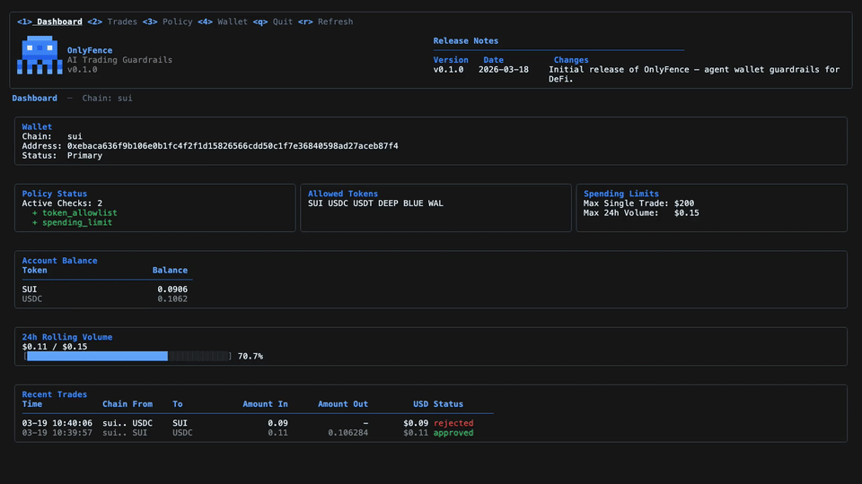

<p align="center">
  
</p>

<h1 align="center">OnlyFence</h1>

<p align="center">
  <strong>Safe, full-featured DeFi toolkit for AI agents.</strong><br />
  <sub>Guardrails first. Swap, lend, borrow, and manage positions — without risking your wallet.</sub>
</p>

<p align="center">
  <a href="#install"></a>
  <a href="#deploy-with-docker--kubernetes"></a>
  <a href="#"></a>
  <a href="#supported-chains"></a>
  <a href="LICENSE"></a>
</p>

---

## What is OnlyFence?

OnlyFence is a **free, open-source DeFi toolkit** that gives your AI agent full onchain capabilities — **with safety guardrails built in from day one**.

Your agent can swap tokens, lend, borrow, open and close positions, and run complex strategies. OnlyFence makes sure it can **never go beyond the limits you set**.

Think of it like giving your AI agent a **company credit card with spending limits** instead of handing over your bank account.

<p align="center">
  
</p>

### The Problem

AI agents need wallet access to trade, lend, borrow, and manage positions. But raw wallet access means:

- The agent can trade tokens you didn't approve
- There's no limit on how much it can spend
- A single bug or prompt injection can drain everything in seconds
- You have zero visibility into what it's actually doing

**You wouldn't give an employee unlimited access to the company funds.** So why give your AI agent unlimited access to your wallet?

### The Solution

OnlyFence gives your agent **everything it needs to execute DeFi strategies** — while keeping you in control.

```
Your AI Agent → OnlyFence → Blockchain
                   │
      ┌────────────┴────────────┐
      │  ✅ Token approved?      │
      │  ✅ Under trade limit?   │
      │  ✅ Under daily limit?   │
      │  ✅ Strategy allowed?    │
      └─────────────────────────┘

  All checks pass → action executes
  Any check fails → action blocked, you stay safe
```

<p align="center">
  <video src="static/video/demo.mp4" width="720" controls alt="OnlyFence demo — setup, swap, and spending limit block"></video>
</p>

---

## What Can Your Agent Do With OnlyFence?

| Action | Status | Description |
|--------|--------|-------------|
| **Swap** | Live | Trade tokens across multiple DEXes with best-price routing |
| **Check balance** | Live | Query wallet balances and token prices |
| **Lend** | Coming soon | Supply assets to lending protocols to earn yield |
| **Borrow** | Coming soon | Borrow against collateral for leveraged strategies |
| **Open position** | Coming soon | Enter leveraged long/short positions |
| **Close position** | Coming soon | Exit positions and take profit or cut losses |
| **LP (Liquidity)** | Coming soon | Deposit, withdraw, compound, and rebalance LP positions |
| **Stake** | Coming soon | Stake tokens for protocol rewards |

Every action goes through your safety rules first. Your agent gets rich DeFi capabilities — you keep full control.

<p align="center">
  
</p>

---

## Why OnlyFence?

| | Without OnlyFence | With OnlyFence |
|---|---|---|
| **DeFi capabilities** | Build everything yourself | Swap, lend, borrow, LP — out of the box |
| **Spending control** | Unlimited — agent can spend everything | You set per-trade and daily limits |
| **Token control** | Agent can trade anything | Only tokens you approve |
| **Visibility** | No idea what the agent is doing | Full history with audit log |
| **Your keys** | Often sent to a server | Stay on your computer, encrypted |
| **Infrastructure** | Usually needs a server or account | Nothing — runs 100% on your machine |
| **Cost** | Often paid service | Free and open source |

---

## Install

One command. Takes about 30 seconds.

```sh
curl -fsSL https://raw.githubusercontent.com/seallabs/onlyfence/main/install.sh | sh
```

That's it. No account needed. No sign-up. No credit card.

<p align="center">
  
</p>

<details>
<summary><strong>Install a specific version</strong></summary>

```sh
curl -fsSL https://raw.githubusercontent.com/seallabs/onlyfence/main/install.sh | ONLYFENCE_VERSION=0.1.0 sh
```

</details>

<details>
<summary><strong>Build from source</strong></summary>

Requires Node.js >= 25.

```sh
git clone https://github.com/seallabs/onlyfence.git
cd onlyfence
npm install && npm run build
```

</details>

### Requirements

- **macOS** (Intel or Apple Silicon) or **Linux** (x64 or ARM64)
- No other dependencies — Node.js runtime is bundled

---

## Deploy with Docker / Kubernetes

OnlyFence ships as a Docker image for production deployments. The daemon runs inside the container and exposes a TCP endpoint for your agent — private keys never leave the container.

```
┌──────────────┐       ┌──────────────────┐
│ AI Agent     │  TCP  │ OnlyFence        │
│ (any host)   │──────►│ (container)      │
│              │:19876 │                  │
│ No keys     │       │ Keys in memory   │
│ No password  │       │ Guardrails apply │
└──────────────┘       └──────────────────┘
```

### Docker Compose

```sh
# 1. Create secret files
echo "your-mnemonic-phrase" > .fence_mnemonic
echo "your-password" > .fence_password
chmod 600 .fence_mnemonic .fence_password

# 2. Start
docker compose up -d
```

On first run the entrypoint automatically imports the wallet from the mnemonic and starts the daemon. On subsequent runs (restarts, upgrades) the keystore already exists and the mnemonic is ignored.

Your agent connects to `127.0.0.1:19876`:

```sh
fence swap SUI USDC 100 --addr 127.0.0.1:19876 --output json
```

See [`docker-compose.yml`](docker-compose.yml) for the full reference configuration, including read-only filesystem, dropped capabilities, and no-new-privileges.

<details>
<summary><strong>Non-interactive setup (CI / scripts)</strong></summary>

`fence setup` supports fully non-interactive mode for scripted environments:

```sh
# Import from file
fence setup --mnemonic-file /run/secrets/mnemonic --password-file /run/secrets/password

# Import from stdin
echo "word1 word2 ..." | fence setup --password-file /run/secrets/password

# Generate new wallet (outputs JSON with mnemonic to stdout)
fence setup --generate --password-file /run/secrets/password
```

</details>

### Kubernetes / Helm

OnlyFence works with any Kubernetes secret management — native Secrets, HashiCorp Vault (via Agent Injector or CSI), AWS Secrets Manager, or sealed-secrets. Mount the password and mnemonic as files and point the container at them.

```yaml
# Example: K8s Deployment with native Secrets
apiVersion: apps/v1
kind: Deployment
metadata:
  name: onlyfence
spec:
  replicas: 1
  template:
    spec:
      containers:
        - name: onlyfence
          image: ghcr.io/seallabs/onlyfence:latest
          ports:
            - containerPort: 19876
          env:
            - name: FENCE_PASSWORD_FILE
              value: /run/secrets/fence_password
          volumeMounts:
            - name: secrets
              mountPath: /run/secrets
              readOnly: true
            - name: data
              mountPath: /data
          securityContext:
            readOnlyRootFilesystem: true
            allowPrivilegeEscalation: false
            capabilities:
              drop: [ALL]
      volumes:
        - name: secrets
          secret:
            secretName: onlyfence-secrets
        - name: data
          persistentVolumeClaim:
            claimName: onlyfence-data
```

<details>
<summary><strong>HashiCorp Vault integration</strong></summary>

With the Vault Agent Injector, secrets are written to a shared tmpfs volume. Point `FENCE_PASSWORD_FILE` and `FENCE_MNEMONIC_FILE` at the injected paths:

```yaml
annotations:
  vault.hashicorp.com/agent-inject: "true"
  vault.hashicorp.com/agent-inject-secret-password: "secret/data/onlyfence/password"
  vault.hashicorp.com/agent-inject-template-password: |
    {{- with secret "secret/data/onlyfence/password" -}}
    {{ .Data.data.value }}
    {{- end -}}
env:
  - name: FENCE_PASSWORD_FILE
    value: /vault/secrets/password
  - name: FENCE_MNEMONIC_FILE
    value: /vault/secrets/mnemonic
```

</details>

### Container security

The Docker image and reference Compose file include production hardening out of the box:

| Feature | Description |
|---------|-------------|
| **Non-root user** | Runs as `onlyfence` user, never root |
| **Read-only filesystem** | Container root is immutable (`read_only: true`) |
| **No capabilities** | All Linux capabilities dropped (`cap_drop: ALL`) |
| **No privilege escalation** | `no-new-privileges` enforced |
| **Password via file** | Secrets injected as files on tmpfs — never as environment variables |
| **Loopback-only TCP** | Daemon binds to `127.0.0.1` — not exposed to the network |
| **Process hardening** | `PR_SET_DUMPABLE=0` on Linux, `PT_DENY_ATTACH` on macOS |

---

## Getting Started

The installer runs `fence setup` automatically, so your wallet is ready to go after install.

> **Important:** Write down the mnemonic phrase shown during install and keep it somewhere safe. This is the only way to recover your wallet. OnlyFence will never show it again.

### Step 1: Set Your Rules

Your safety rules are in a simple config file. The defaults are sensible, but you can change them anytime:

```sh
fence config show
```

```toml
[chain.sui.allowlist]
tokens = ["SUI", "USDC", "USDT", "DEEP", "BLUE", "WAL"]   # Only these tokens can be traded

[chain.sui.limits]
max_single_trade = 200.0     # No single trade above $200
max_24h_volume   = 500.0     # No more than $500 per day total
```

**Change a rule:**
```sh
# Allow up to $1000 per day
fence config set chain.sui.limits.max_24h_volume 1000

# Add a new token to the approved list
fence config set chain.sui.allowlist.tokens '["SUI", "USDC", "USDT", "DEEP", "BLUE", "WAL", "CETUS"]'
```

### Step 2: Let Your Agent Work

```sh
# Swap tokens — guardrails check every trade automatically
fence swap SUI USDC 10

# Check wallet balance
fence query balance

# Get token prices
fence query price SUI,USDC

# Coming soon: lend, borrow, open positions, and more
# fence lend SUI 100 --protocol navi
# fence borrow USDC 50 --collateral SUI
```

Your agent calls these commands and gets structured JSON responses. Every action is checked against your rules before it touches the chain.

### Step 3: Open the Dashboard

You don't have to use the command line for everything. OnlyFence includes a **full interactive dashboard** right in your terminal — just run:

```sh
fence
```

From the dashboard you can:
- **See your balances** and portfolio at a glance
- **Browse trade history** — every action your agent took, with status
- **View and change your safety rules** — no need to edit config files manually
- **Manage wallets** — switch between wallets, check addresses

<p align="center">
  
</p>

---

## How It Works

When your agent calls any OnlyFence command, here's what happens:

```
1. 📋 Load your safety rules from config
2. ✅ Check: is the token on your approved list?
3. ✅ Check: is this under your per-trade limit?
4. ✅ Check: would this put you over your daily limit?
5. 💰 Find the best execution route (across multiple exchanges)
6. 🧪 Simulate first (dry run — no real money yet)
7. ✍️ Sign and submit the transaction
8. 📝 Log everything (so you can review later)
```

If **any** check fails, the action is blocked. Your money stays safe.

Every action — approved or rejected — is saved in a local database so you always have a complete audit trail. This works the same whether your agent is swapping, lending, borrowing, or managing positions.

---

## Connecting Your AI Agent

OnlyFence works with **any AI agent** — ChatGPT, Claude, custom bots, or your own scripts. Instead of building blockchain logic yourself, your agent calls `fence` commands and gets structured JSON back.

**Your agent runs a command like:**
```sh
fence swap SUI USDC 100 --output json
```

**If the action is approved:**
```json
{
  "status": "success",
  "chain": "sui",
  "txDigest": "8Hk4...mW2p",
  "fromToken": "SUI",
  "toToken": "USDC",
  "amountIn": "100",
  "amountOut": "98.12",
  "valueUsd": 98.0,
  "route": "SUI → USDC via Cetus"
}
```

**If the action is blocked by your rules:**
```json
{
  "status": "rejected",
  "check": "spending_limit",
  "reason": "exceeds_24h_volume",
  "detail": "24h $480 + $98 = $578 exceeds $500 limit"
}
```

The agent reads the response and adjusts its strategy — no ambiguity, no guessing. Your agent gets the DeFi building blocks; you set the boundaries.

### Claude Code / Codex Integration

If you use [Claude Code](https://docs.anthropic.com/en/docs/claude-code), [Codex](https://openai.com/index/codex/), or other AI coding agents, OnlyFence provides a native plugin and skill — no manual CLI wiring needed.

**Install the plugin:**
```sh
claude plugin marketplace add seallabs/onlyfence
claude plugin install onlyfence@onlyfence
```

Once installed, your coding agent can call OnlyFence commands directly — swap tokens, check balances, enforce guardrails — all within the agent's natural workflow. The same safety rules apply: every action is checked against your policy before it touches the chain.

---

## Two Ways to Use OnlyFence

### Interactive Dashboard (for you)

Run `fence` to open the full-screen dashboard. Browse your balances, trade history, and safety rules visually — no commands to memorize.

Perfect for monitoring what your agent is doing and tweaking rules on the fly.

### CLI Commands (for your agent)

Your AI agent calls `fence` commands with `--output json` to get structured responses. This is how the agent interacts with DeFi — safely.

| Command | What it does |
|---------|-------------|
| `fence` | Open the interactive dashboard |
| `fence swap SUI USDC 10` | Swap tokens (with safety checks) |
| `fence query balance` | See your wallet balance |
| `fence query price SUI,USDC` | Check token prices in USD |
| `fence wallet list` | See all your wallets |
| `fence config show` | View your current rules |
| `fence config set <key> <value>` | Change a rule |
| `fence unlock` | Unlock your wallet for the session |
| `fence lock` | Lock your wallet |

---

## Supported Chains

| Chain | Status | Exchanges |
|-------|--------|-----------|
| **Sui** | Live | Cetus, DeepBook, Bluefin, FlowX, Turbos (via 7K Aggregator) |
| **EVM** (Ethereum, Base, etc.) | Coming soon | |
| **Solana** | Coming soon | |

---

## FAQ

<details>
<summary><strong>Is OnlyFence free?</strong></summary>

Yes, 100% free and open source. No hidden fees, no premium tier, no account needed.

</details>

<details>
<summary><strong>Is my wallet safe?</strong></summary>

Your private keys are encrypted and stored locally on your computer. They never leave your machine. OnlyFence doesn't have servers — everything runs locally.

</details>

<details>
<summary><strong>What if I lose my mnemonic phrase?</strong></summary>

If you lose your mnemonic, you lose access to your wallet. OnlyFence cannot recover it for you. Write it down and store it somewhere safe when you first run `fence setup`.

</details>

<details>
<summary><strong>Can I use my existing wallet?</strong></summary>

Yes. During `fence setup`, choose "Import existing private key or mnemonic" to use a wallet you already have.

</details>

<details>
<summary><strong>What happens if the price oracle is down?</strong></summary>

OnlyFence uses a **fail-closed** approach. If the oracle is unreachable, it falls back to a cached price for up to 5 minutes. If the cache is stale or absent, the trade is **rejected** — not silently allowed. Token allowlist checks always apply regardless of oracle status.

</details>

<details>
<summary><strong>Does OnlyFence charge any fees on trades?</strong></summary>

No. OnlyFence doesn't take any fees. You only pay the normal blockchain gas fees and any DEX fees from the swap itself.

</details>

<details>
<summary><strong>Can I run this on a server / VPS / Kubernetes?</strong></summary>

Yes. OnlyFence runs standalone on any machine, or as a Docker container on Docker Compose, Kubernetes, ECS, or any container runtime. See [Deploy with Docker / Kubernetes](#deploy-with-docker--kubernetes) for production setup guides.

</details>

---

## Roadmap

What's coming next:

**More DeFi actions:**
- **Lending & borrowing** — supply assets to earn yield, borrow against collateral
- **Position management** — open/close leveraged long/short positions
- **LP operations** — deposit, withdraw, compound, and rebalance liquidity
- **Staking** — stake tokens for protocol rewards

**More guardrails:**
- **Token denylist** — block specific tokens instead of maintaining an allowlist
- **Trade frequency limits** — prevent too many trades in a short period
- **P&L-based circuit breaker** — auto-stop the agent when losses hit a threshold

**More chains:**
- **EVM** (Ethereum, Base, Arbitrum, etc.)
- **Solana**

**More control:**
- **Telegram alerts** — get notified when actions happen or get blocked
- **Telegram approval gate** — manually approve actions from your phone
- **P&L tracking** — see your profit/loss in real time

---

## Security

- Private keys are encrypted at rest with your password
- Mnemonics are shown once during setup and never stored in plaintext
- All policy evaluation happens locally — no data leaves your machine
- Every transaction is simulated before signing (dry run)
- Full audit trail of every trade attempt

See [SECURITY.md](SECURITY.md) for our vulnerability reporting policy.

---

## Contributing

We welcome contributions! See [CONTRIBUTING.md](CONTRIBUTING.md) for guidelines.

---

<p align="center">
  
  <br />
  <sub>Built by <a href="https://github.com/seallabs">Seal Labs</a> &middot; Powered by <a href="https://7k.ag">7K DeFi</a></sub>
  <br />
  <sub>
    <a href="#install">Install</a> &middot;
    <a href="#deploy-with-docker--kubernetes">Docker / K8s</a> &middot;
    <a href="#getting-started">Getting Started</a> &middot;
    <a href="#all-commands">Commands</a> &middot;
    <a href="#faq">FAQ</a> &middot;
    <a href="https://github.com/seallabs/onlyfence/issues">Report a Bug</a>
  </sub>
</p>
