# OnlyFence — Technical Specification

**Version 3.1 | March 2026**
**Audience: Engineering Team**

---

## 1. System Overview

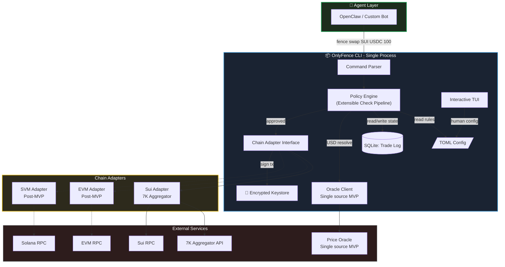


---

## 2. Policy Engine — Extensible Pipeline

The policy engine is the core differentiator of OnlyFence. It runs as a **pipeline of independent check functions** in sequence. MVP ships with 2 checks. The interface is designed so every future guardrail drops in as a new check without modifying existing code.

### 2.1 Check Interface and Registry

```mermaid
classDiagram
    class PolicyCheck {
        <<interface>>
        +name: string
        +description: string
        +evaluate(intent: TradeIntent, ctx: PolicyContext) CheckResult
    }

    class CheckResult {
        +status: pass or reject
        +reason?: string
        +detail?: string
        +metadata?: Record
    }

    class TradeIntent {
        +chain: string
        +action: string
        +fromToken: string
        +toToken: string
        +amount: bigint
        +protocol?: string
        +pool?: string
        +walletAddress: string
    }

    class PolicyContext {
        +config: ChainPolicyConfig
        +db: SQLiteDatabase
        +oracle: OracleClient
        +tradeValueUsd?: number
    }

    class TokenAllowlistCheck {
        +name = token_allowlist
        +evaluate(intent, ctx) CheckResult
    }

    class SpendingLimitCheck {
        +name = spending_limit
        +evaluate(intent, ctx) CheckResult
    }

    class TokenDenylistCheck {
        +name = token_denylist
    }

    class ProtocolAllowlistCheck {
        +name = protocol_allowlist
    }

    class PoolDenylistCheck {
        +name = pool_denylist
    }

    class CircuitBreakerCheck {
        +name = circuit_breaker
    }

    class FrequencyLimitCheck {
        +name = frequency_limit
    }

    class CostBasisPnLCheck {
        +name = cost_basis_pnl
    }

    class ApprovalGateCheck {
        +name = approval_gate
    }

    PolicyCheck <|.. TokenAllowlistCheck : MVP
    PolicyCheck <|.. SpendingLimitCheck : MVP
    PolicyCheck <|.. TokenDenylistCheck : Post-MVP
    PolicyCheck <|.. ProtocolAllowlistCheck : Post-MVP
    PolicyCheck <|.. PoolDenylistCheck : Post-MVP
    PolicyCheck <|.. CircuitBreakerCheck : Post-MVP
    PolicyCheck <|.. FrequencyLimitCheck : Post-MVP
    PolicyCheck <|.. CostBasisPnLCheck : Post-MVP
    PolicyCheck <|.. ApprovalGateCheck : Post-MVP
```


### 2.2 Pipeline Growth Path

```mermaid
flowchart LR
    subgraph MVP["MVP - 2 checks"]
        direction LR
        C1["① Token\nAllowlist"] --> C2["② Spending\nLimit"]
    end

    subgraph V2["Release 2"]
        direction LR
        D1["① Token\nAllowlist"] --> D1b["② Token\nDenylist"] --> D2["③ Protocol\nAllowlist"] --> D3["④ Pool\nDenylist"] --> D4["⑤ Spending\nLimit"]
    end

    subgraph V3["Release 3"]
        direction LR
        E4["①-⑤"] --> E5["⑥ Circuit\nBreaker"] --> E6["⑦ Frequency\nLimit"]
    end

    subgraph V4["Release 4+"]
        direction LR
        F1["①-⑦"] --> F8["⑧ Cost-Basis\nP&L"] --> F9["⑨ Approval\nGate"]
    end

    MVP -.->|"add checks"| V2
    V2 -.->|"add checks"| V3
    V3 -.->|"add checks"| V4

    style MVP fill:#1c2d1c,stroke:#27AE60,color:#fff
    style V2 fill:#1a2332,stroke:#2E86C1,color:#fff
    style V3 fill:#1a2332,stroke:#2E86C1,color:#fff
    style V4 fill:#2d2a1c,stroke:#D4AC0D,color:#fff
```


### 2.3 Config-Driven Check Loading

Checks are registered based on which config sections exist. No config section = check not loaded.

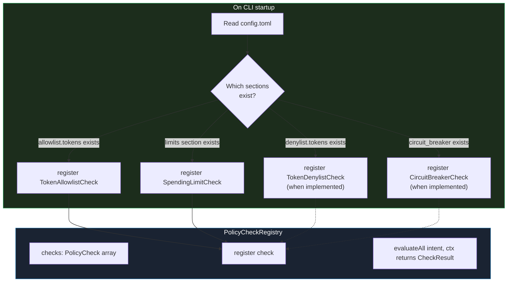


Adding a new guardrail type requires: (1) implement PolicyCheck interface — one file, (2) define config schema — one TOML section, (3) register in loader — one line. Zero changes to existing checks or pipeline logic.

---

## 3. Trade Execution Flow — MVP

```mermaid
sequenceDiagram
    participant Agent
    participant CMD as Command Parser
    participant PE as Policy Engine
    participant ORC as Oracle
    participant DB as SQLite
    participant CA as Chain Adapter
    participant AGG as 7K Aggregator
    participant RPC as Sui RPC
    participant KS as Keystore

    Agent->>CMD: fence swap SUI USDC 100 --slippage 0.5%
    CMD->>PE: TradeIntent from SUI to USDC amount 100 chain sui

    rect rgb(30, 40, 55)
        Note over PE,DB: Policy Pipeline — 2 checks
        PE->>PE: ① Token allowlist: SUI in tokens? USDC in tokens?
        alt Token not allowed
            PE-->>Agent: REJECT token not in allowlist
        end
        PE->>ORC: ② GET SUI/USD price
        ORC-->>PE: $0.98
        Note over PE: trade_value = 100 x $0.98 = $98
        PE->>PE: max_single_trade: $98 le $200 pass
        PE->>DB: SELECT SUM value_usd FROM trades WHERE chain sui AND ts gt now minus 24h
        DB-->>PE: $312.60
        Note over PE: $312.60 + $98 = $410.60 le $500 pass
    end

    PE->>CA: APPROVED
    CA->>AGG: GET quote SUI to USDC 100 slippage 0.5%
    AGG-->>CA: route expectedOutput 98.12

    CA->>RPC: dryRunTransactionBlock txData
    alt Simulation fails
        CA-->>Agent: REJECT simulation failed
    end

    CA->>KS: sign txData
    KS-->>CA: signedTx
    CA->>RPC: executeTransactionBlock signedTx
    RPC-->>CA: txDigest 8Hk4...mW2p

    rect rgb(25, 45, 30)
        Note over CA,DB: Post-Trade Logging
        CA->>DB: INSERT INTO trades chain tokens amounts value_usd tx_digest gas timestamp
        Note over CA: value_usd from pre-trade oracle price in step ②
    end

    CA-->>Agent: SUCCESS txDigest 8Hk4...mW2p amountIn 100 amountOut 98.12 gas 0.0021
```


---

## 4. **Policy Decision Tree — MVP**

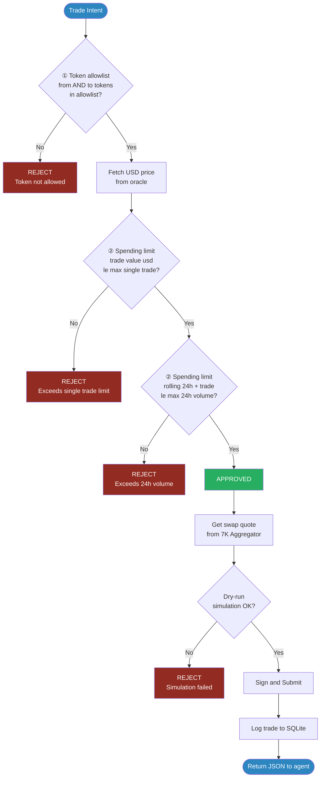


### Future Decision Tree — Full Guardrail Suite

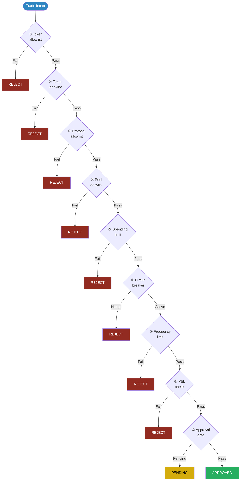


---

## 5. Data Model — SQLite

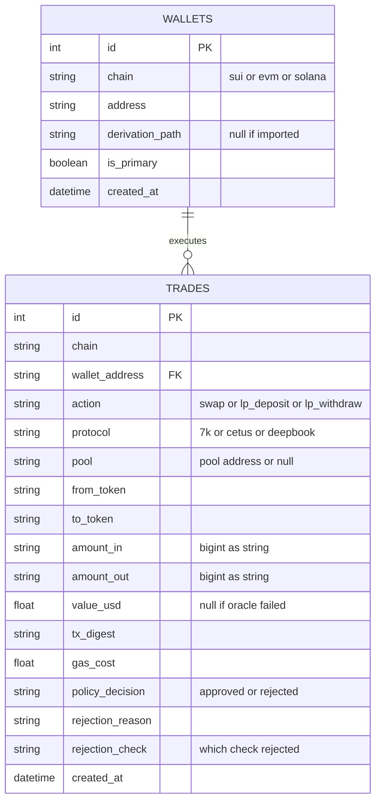


Schema extensibility notes:

- protocol and pool fields stored on every trade even though MVP does not enforce protocol or pool rules — historical data is ready when those checks ship
- rejection_check records which pipeline check rejected — useful for analytics and debugging
- No circuit_breaker table in MVP — added later without modifying existing tables
- No cost_basis table in MVP — added later as a holdings table with avg_cost_usd and quantity

---

## 6. CLI Command Tree

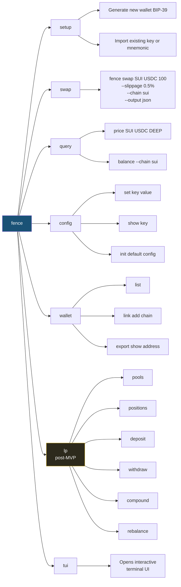


---

## 7. Wallet Setup Flow

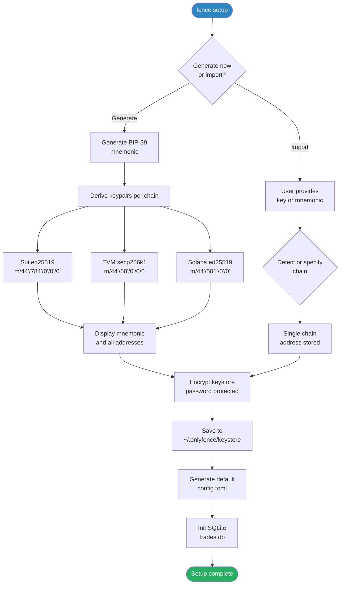


---

## 8. Chain Adapter Interface

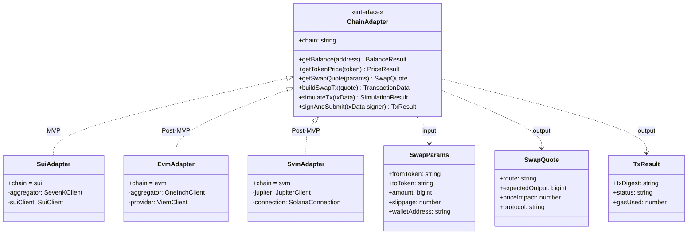


---

## 9. Policy Config Schema

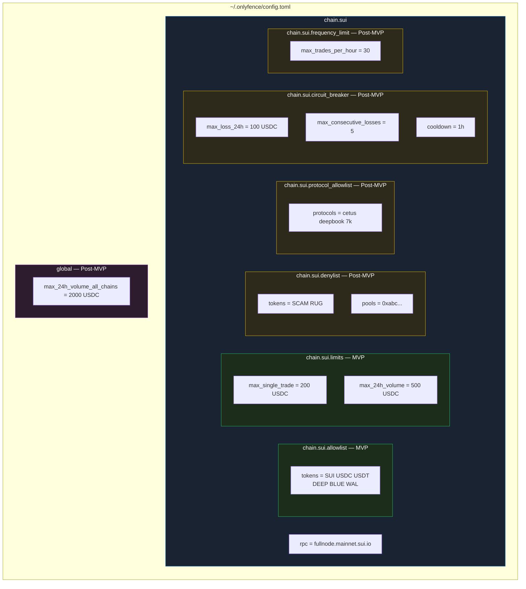


---

## 10. Oracle Failure Handling

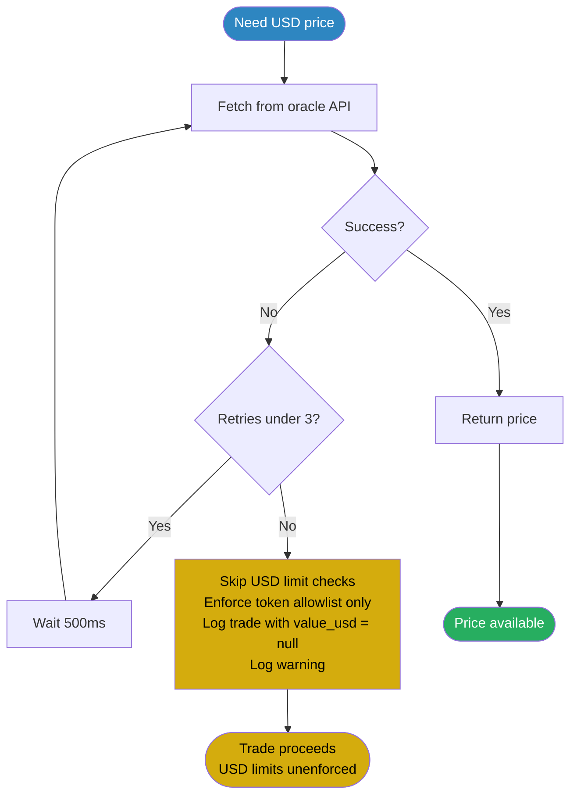


MVP uses a single oracle source. Multiple sources with fallback chain is a post-MVP enhancement. When the oracle is unreachable after 3 retries, the trade still proceeds but only the token allowlist is enforced — USD-based spending limits are temporarily bypassed and the trade is logged with null value_usd.

---

## 11. File System Layout

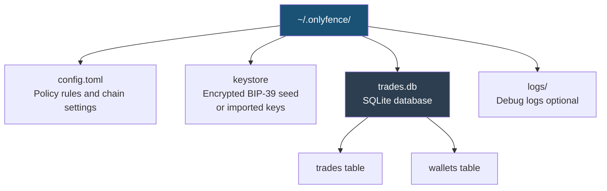


---

## 12. Module Dependencies

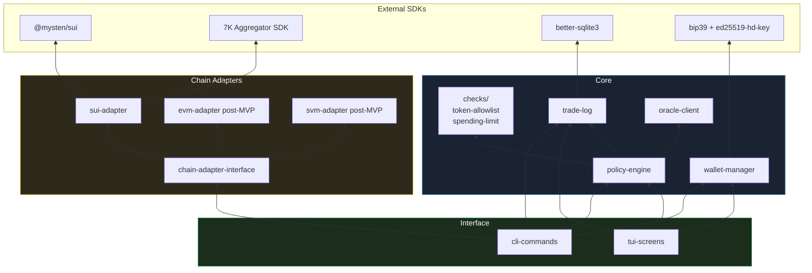


---

## 13. JSON Output Schema

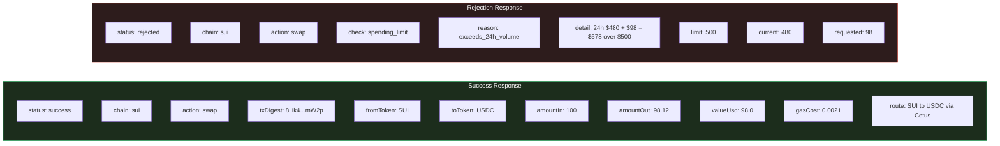


---

## 14. Security Model

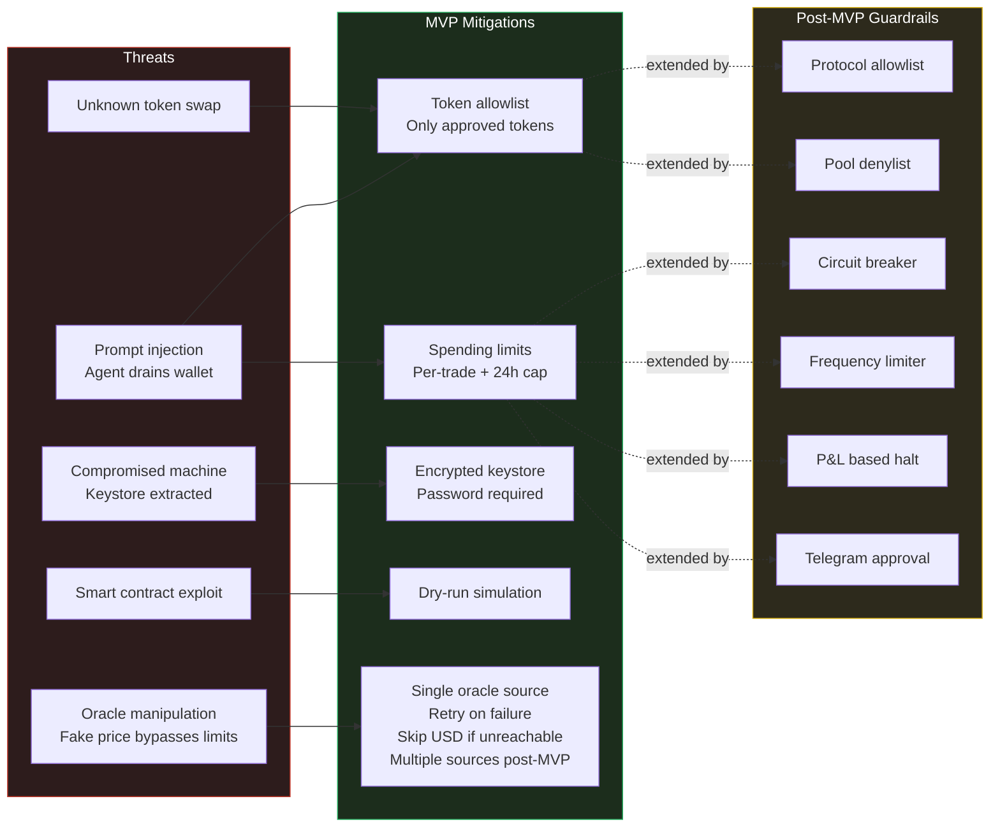


---

## 15. MVP Sprint Plan

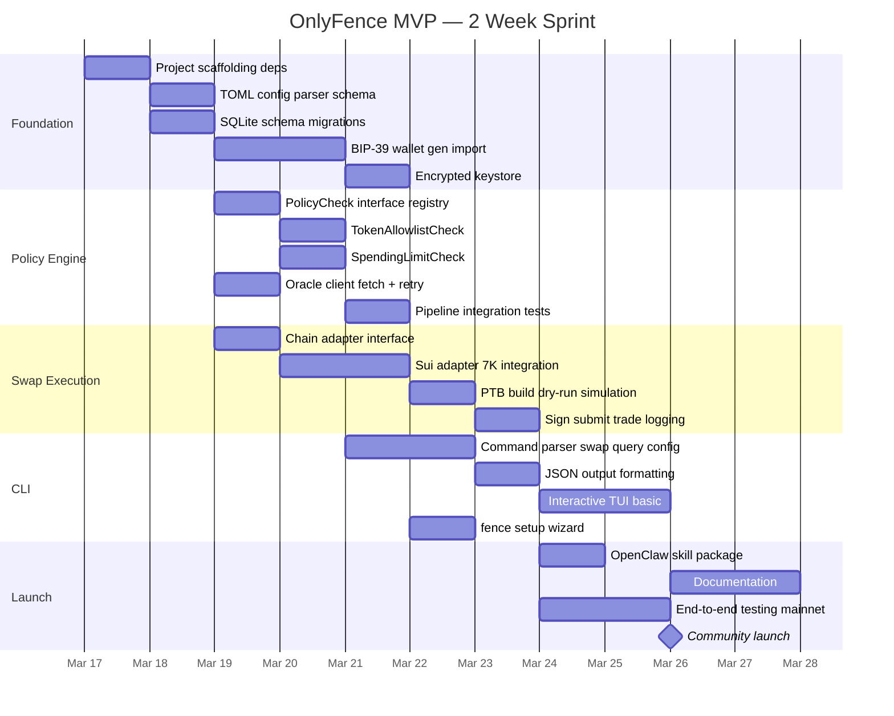


---

## 16. Tech Stack

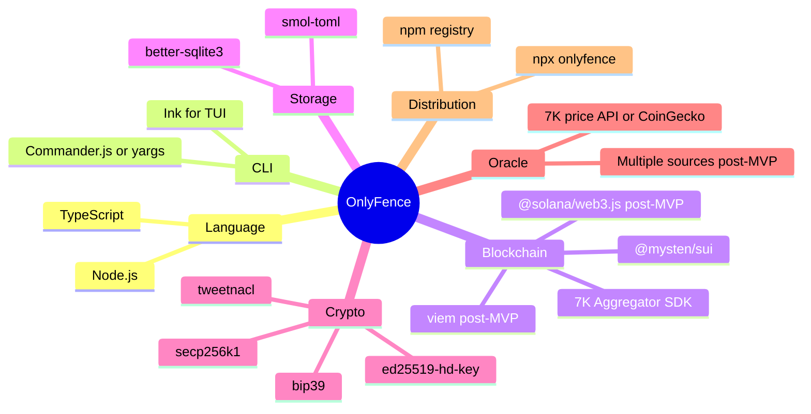


---

## 17. Post-MVP Full Pipeline

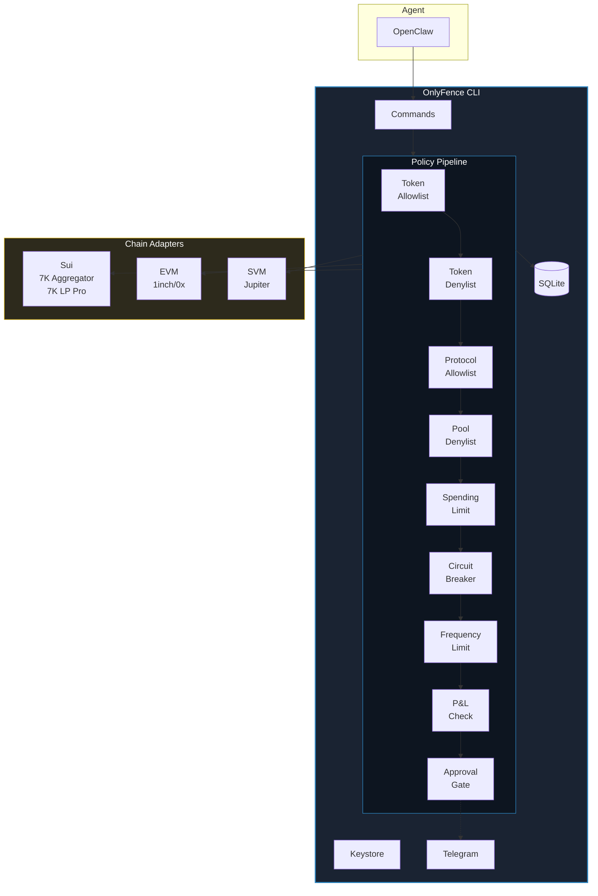


---

## 18. Guardrail Roadmap

```mermaid
timeline
    title OnlyFence Guardrail Evolution
    MVP Week 1-2
        : Token Allowlist
        : Spending Limits — single trade + 24h volume
    Release 2
        : Token Denylist
        : Protocol Allowlist
        : Pool Denylist
    Release 3
        : Circuit Breaker — volume + frequency
        : Trade Frequency Limit
    Release 4
        : Cost-Basis P&L Tracking
        : P&L-Based Circuit Breaker
    Release 5
        : Telegram Notifications
        : Telegram Approval Gate
    Release 6
        : Global Cross-Chain Policy
        : Unified Spending Across Chains
```


