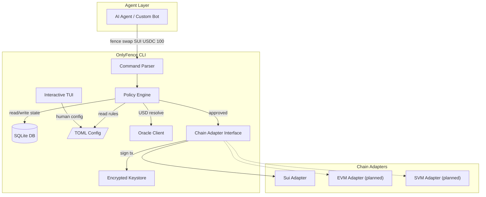
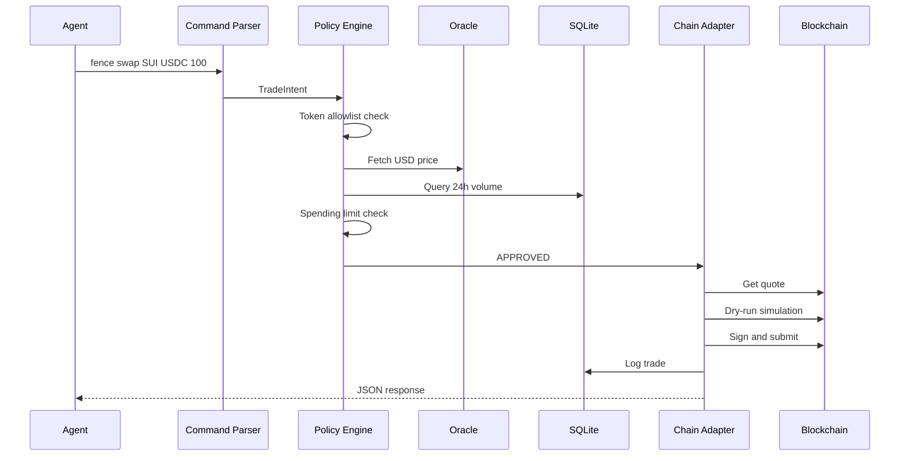

# Architecture Overview

OnlyFence is a single-process CLI tool that sits between your AI agent and the blockchain. It enforces safety policies before executing any onchain action.

## System Architecture



## Key Components

### Command Parser
Parses CLI arguments using Commander.js. Routes to the appropriate handler. Supports `--output json` for machine-readable output.

### Policy Engine
The core differentiator. Runs a pipeline of independent check functions in sequence. If any check rejects, the action is blocked. See [Policy Engine](./policy-engine) for details.

### Chain Adapters
Chain-specific implementations behind a common interface. Each adapter handles quote fetching, transaction building, simulation, signing, and submission. See [Chain Adapters](./chain-adapters) for details.

### Encrypted Keystore
BIP-39 mnemonic generation and Ed25519 key derivation. Keys are encrypted at rest with a user-provided password. Plaintext never touches disk.

### SQLite Database
Stores trade history, wallet metadata, and coin metadata cache. Every action — approved or rejected — is logged with timestamps, amounts, USD values, and policy decisions.

### Oracle Client
Fetches real-time USD prices for spending limit enforcement. Uses LP Pro as the primary source with retry logic and fail-closed behavior.

### Interactive TUI
Full-screen terminal dashboard built with React/Ink. Shows balances, trade history, safety rules, and wallet info.

## Data Flow



## File System Layout

```
~/.onlyfence/
  config.toml      # Policy rules and chain settings
  keystore         # Encrypted BIP-39 seed or imported keys
  onlyfence.db     # SQLite database
  logs/            # Debug logs
```
