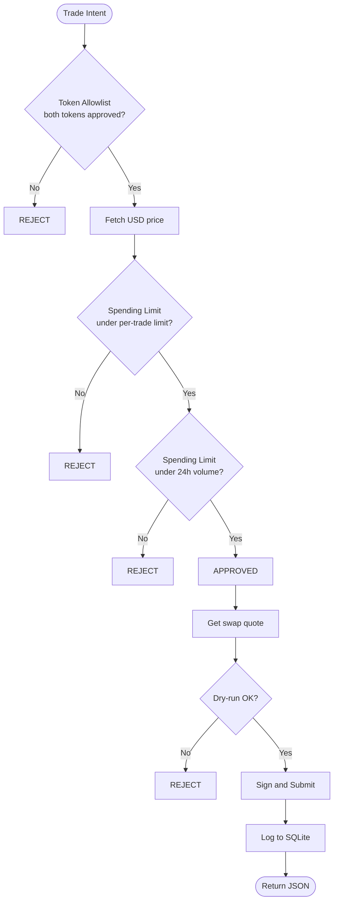
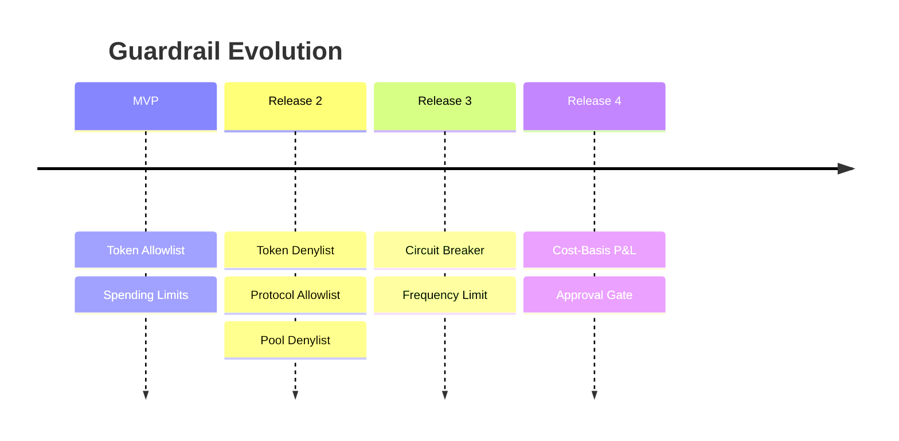

# Policy Engine

The policy engine is the core of OnlyFence. It runs a **pipeline of independent check functions** in sequence. Each check evaluates a trade intent and returns pass or reject.

## How It Works

Every action your agent requests goes through the policy pipeline before execution:



## Check Interface

Every policy check implements the `PolicyCheck` interface:

```typescript
interface PolicyCheck {
  name: string;
  description: string;
  evaluate(intent: TradeIntent, ctx: PolicyContext): CheckResult;
}

interface CheckResult {
  status: 'pass' | 'reject';
  reason?: string;
  detail?: string;
  metadata?: Record<string, unknown>;
}
```

## Current Checks

### Token Allowlist

Verifies both the source and destination tokens are in the configured allowlist.

```toml
[chain.sui.allowlist]
tokens = ["SUI", "USDC", "USDT", "DEEP", "BLUE", "WAL"]
```

### Spending Limit

Two-part check:
1. **Per-trade limit** — trade USD value must be under `max_single_trade`
2. **Daily volume** — rolling 24h total must stay under `max_24h_volume`

```toml
[chain.sui.limits]
max_single_trade = 200.0
max_24h_volume = 500.0
```

## Config-Driven Loading

Checks are registered based on which config sections exist. No config section = check not loaded.

## Adding a New Check

Adding a new guardrail requires three steps:

1. **Implement `PolicyCheck`** — one file
2. **Define config schema** — one TOML section
3. **Register in loader** — one line

Zero changes to existing checks or pipeline logic.

## Planned Checks



## Oracle Failure Handling

If the price oracle is unreachable after 3 retries:

- OnlyFence uses a **fail-closed** approach
- Falls back to cached price for up to 5 minutes
- If cache is stale or absent, the trade is **rejected**
- Token allowlist checks always apply regardless of oracle status
